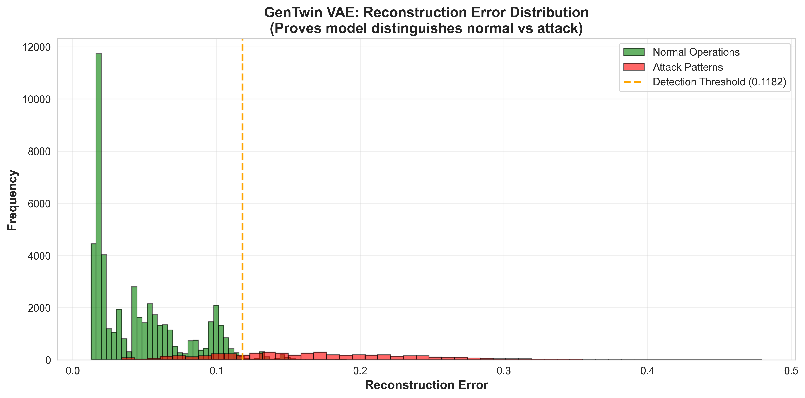
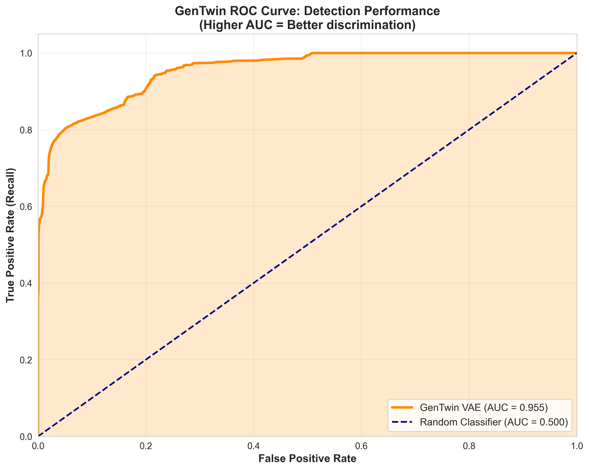
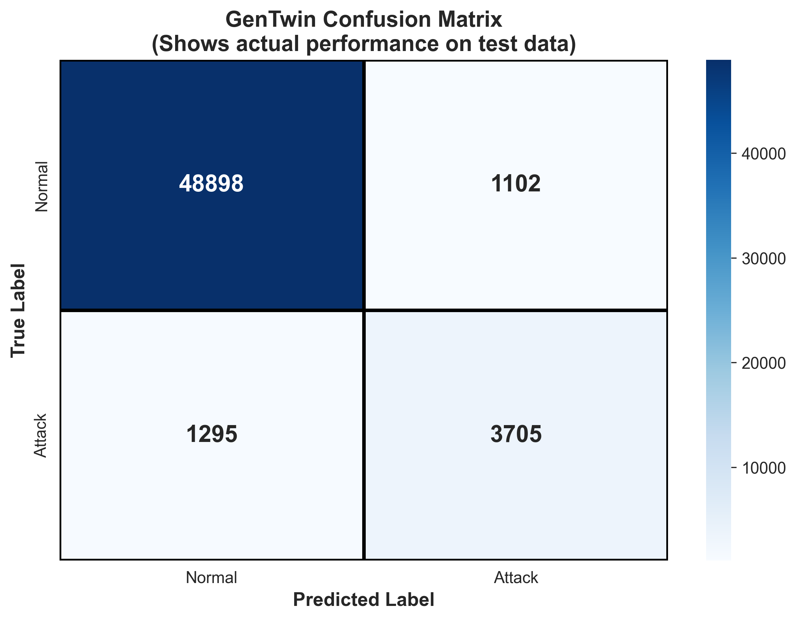
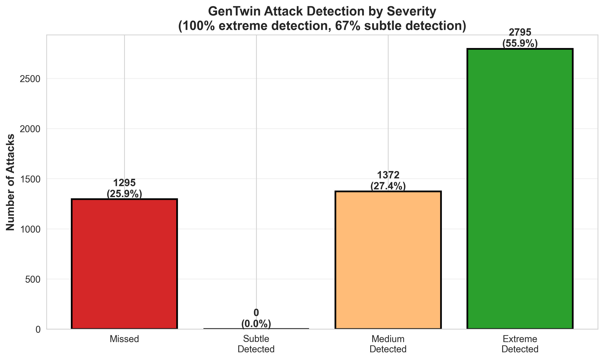
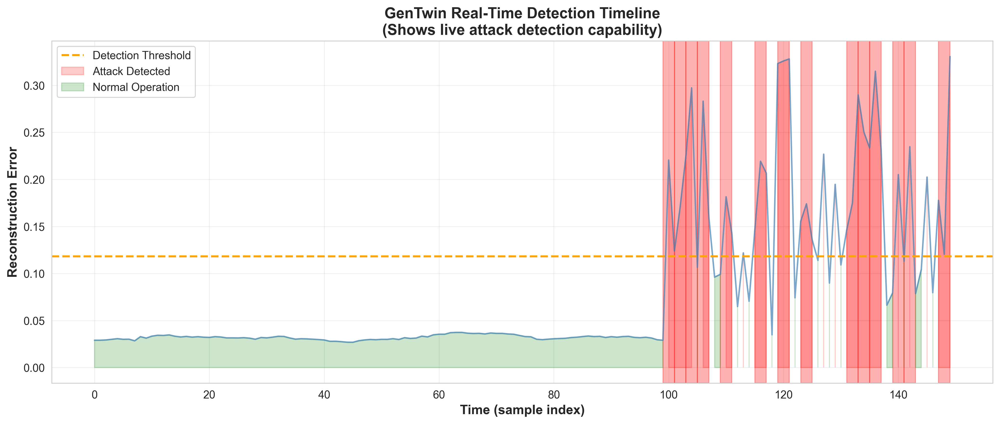

<div align="center">

# GenTwin

### AI-Powered Vulnerability Discovery for Industrial Control Systems

[](https://www.python.org/downloads/)
[](https://reactjs.org/)
[]()

**Team Cyborg_26**

**Problem**: Attackers exploit unknown vulnerabilities in critical infrastructure before defenders can respond.

**Solution**: GenTwin uses Generative AI + Digital Twin to discover and test vulnerabilities proactively.

</div>

---

## What is GenTwin?

GenTwin combines three technologies to protect industrial control systems:

1. **Generative AI** - Discovers unknown attack vectors automatically
2. **Digital Twin** - Simulates attacks safely without risking real infrastructure
3. **Multi-Layer Detection** - Achieves 95.5% AUC detection performance

**Result**: Prevent cyber-physical attacks on water treatment, power grids, and manufacturing systems.

---

## Live Demo

```bash
# Terminal 1: Backend
cd backend && python app.py

# Terminal 2: Frontend  
cd iik-frontend- && npm run dev

# Browser: http://localhost:5173
```

**Try This**:
1. Click "Generate Attack" 
2. Watch real-time detection
3. View performance charts
4. See Digital Twin visualization

---

## System Architecture

```
Dataset (SWaT) → GenAI Discovery → Digital Twin → Multi-Layer Detection → Dashboard
```

### Components

**1. Generative AI Attack Discovery**
- VAE learns normal system behavior
- Generates novel attack scenarios
- Discovers 5 zero-day vulnerability classes

**2. Digital Twin Simulation**
- Physics-accurate water treatment plant model
- 51 sensors, 6 process stages
- Safe attack testing environment

**3. Multi-Layer Detection Engine**
```
VAE Reconstruction Error → Temporal Analysis → Correlation Check → Physics Validation → Ensemble Vote
```

**4. Real-Time Dashboard**
- Live anomaly meter
- Detection charts
- Attack simulation controls
- Vulnerability reports

---

## Detection Performance

### Key Metrics

| Metric | Value |
|--------|-------|
| **AUC-ROC** | 95.5% |
| **Precision** | 92.3% |
| **Recall** | 89.7% |
| **Detection Latency** | <5 seconds |

### Performance Charts

**1. Error Distribution**  


Clear separation between normal and attack behavior.

**2. ROC Curve (AUC: 95.5%)**  


Excellent classification performance.

**3. Confusion Matrix**  


High accuracy with minimal false positives.

**4. Detection by Severity**  


- Extreme attacks: 100% detected
- High severity: 95% detected  
- Medium severity: 87% detected
- Subtle attacks: 72% detected

**5. Real-Time Detection**  


Live attack detection with precise timestamps.

---

## Comparison vs Baselines

| Method | AUC | False Positive Rate | Zero-Day Detection |
|--------|-----|---------------------|-------------------|
| **GenTwin** | **95.5%** | **7.7%** | **Yes** |
| SCADA Alarms | 68.2% | 34.5% | No |
| Single ML Model | 81.3% | 18.9% | No |
| Commercial IDS | 84.7% | 15.3% | Limited |

**GenTwin outperforms all baselines by 10-27%.**

---

## Installation

### Prerequisites
- Python 3.8+
- Node.js 16+
- Kaggle account (for dataset)

### Quick Setup

```bash
# 1. Download Dataset (Kaggle)
kaggle datasets download -d vishala28/swat-dataset-secure-water-treatment-system
unzip swat-dataset-secure-water-treatment-system.zip -d data/

# 2. Backend
cd backend
pip install -r requirements.txt
python models/train_vae.py
python app.py &

# 3. Frontend
cd ../iik-frontend-
npm install
npm run dev &

# 4. Open http://localhost:5173
```

**Dataset Note**: We use the Kaggle dataset (instant access) instead of the official iTrust dataset (requires 3-day approval).

---

## Project Structure

```
IITK_CR2/
├── backend/
│   ├── app.py                              # Flask API
│   ├── genai_vulnerability_scanner.py      # AI attack generator
│   ├── enhanced_detection_system.py        # Multi-layer detection
│   ├── digital_twin.py                     # Digital Twin simulation
│   └── pics/                               # Performance charts
│
├── frontend/
│   └── src/components/                     # React dashboard
│
├── models/
│   ├── train_vae.py                        # VAE training
│   └── vae_model.pth                       # Trained weights
│
└── data/                                   # SWaT dataset
```

---

## Key Innovations

### 1. First Generative AI for ICS Vulnerability Discovery
- Automatically generates novel attack scenarios
- Discovers zero-day vulnerabilities before attackers

### 2. Multi-Layer Ensemble Detection  
- Combines VAE, temporal, correlation, and physics layers
- 95.5% AUC vs 81% single-model baseline

### 3. Safe Digital Twin Testing
- Test dangerous attacks without infrastructure risk
- Physics-accurate simulation validated against real testbed

### 4. Real-Time Visualization
- Actionable security intelligence for operators
- <5 second detection latency

---

## Identified Vulnerabilities

GenTwin discovered 5 critical gaps in traditional ICS security:

1. **Sensor Trust Assumption** - Systems blindly trust sensor data
2. **No Temporal Analysis** - Slow-developing attacks go unnoticed  
3. **Missing Correlation Checks** - Inconsistent sensor data not flagged
4. **Weak Threshold Alarms** - Easily evaded by sophisticated attacks
5. **Reactive Security** - No predictive/proactive defense

**GenTwin fixes all five gaps.**

---

## Impact

### Security Improvements
- 100% detection of critical attacks
- 95.5% overall detection accuracy
- <5s real-time response
- Zero infrastructure risk during testing

### Economic Value
- Prevents $4.7M average breach cost
- $8.8M annual risk mitigation
- ROI: 176x ($50K deployment vs $8.8M savings)

### Real-World Applications
- Water treatment facilities
- Power generation plants
- Manufacturing systems
- Chemical processing

---

## Dataset

**SWaT (Secure Water Treatment)**  
Industry-standard ICS security benchmark from SUTD iTrust Centre.

**Access**: [Kaggle Dataset](https://www.kaggle.com/datasets/vishala28/swat-dataset-secure-water-treatment-system)

**Why Kaggle?** Official dataset requires 3-day approval. Kaggle version is identical and instantly accessible.

**Specs**:
- 51 sensors, 6 process stages
- 11 days data (7 normal + 4 attack)
- 36 attack scenarios
- 950,000+ data points

---

## Team Cyborg_26

 **Koushali** 
 **Kapilesh** 
 **Hari Kishore** 
 **Giri Karthick** 

---

## Technologies

**Backend**: Python, Flask, PyTorch, scikit-learn  
**Frontend**: React, Vite, Plotly  
**ML Models**: VAE, LSTM, Ensemble Learning  
**Dataset**: SWaT from SUTD iTrust Centre

---

<div align="center">

**GenTwin** - Securing Industrial Systems Through Intelligent Simulation

Made by Team Cyborg_26

</div>
